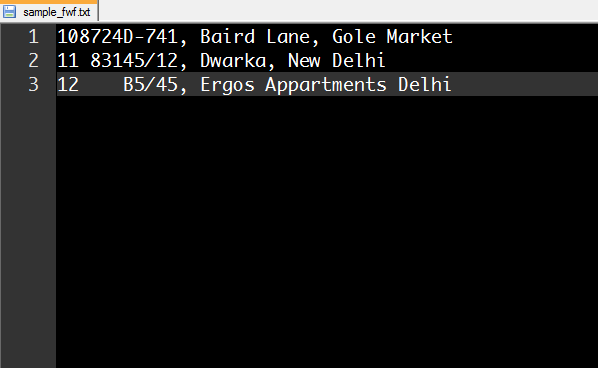
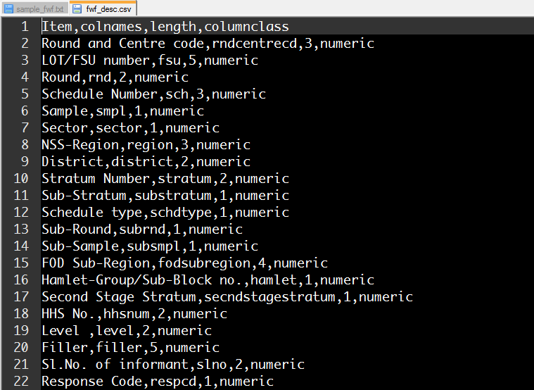

I came across a nice talk by Sumandro (Riju) Chattopadhyay introducing National Sample Survey (NSS) data ([link here](https://www.youtube.com/watch?v=DLs9eEGJzdo)). NSS data is distributed as fixed-width files, correctly referred to as the "Jurassic way" of data distribution by Riju.

Standard softwares can import fixed width format (fwf) files easily. In STATA, you can use infix or infile (used with a dictionary) commands to import. To read about ways to import NSS data in STATA, read this blog post by [Zakaria Siddiqui](https://zakku78.wordpress.com/2009/02/19/nsso-unit-level-data/).

In my first series of blogs, we will learn about ways to import, manage, visualize and analyze NSS data using R. To read fwf files in R, functions like read.fwf from base R can be used. 

If we have a sample fwf file containg the following three rows of data and the layout as given below:

 

Variable Name | Column Start  | Column End
------------- | ------------- | -------------
Serial Number | 1             | 2
Monthly Income| 3             | 6
Address       | 7             | 36

We can import this file using the following R commands.

```{r import_test, warning=FALSE, comment=""}
sample <- read.fwf("sample_fwf.txt", widths = c(2, 4, 30), 
  col.names = c("sNo", "monthlyIncome", "address"), header = FALSE)
sample # print the sample file
```

A possible way out to save you from the manual labor of typing out the column names and corresponding widths of large NSS data is to prepare a cleaner version of the layout file which can be imported using R. The clean layout file (screen-shot provided below) should contain the item description, byte length of the item, a short item description to be provided as column names and corresponding column classes as well, if needed.


 

This layout refers to Level 1 data of NSSO 66th Round Schedule 1.0 Consumer Expenditure Survey. The data distributed for this round has been arranged for different levels (there are 10 levels). Each block of the questionnare is linked to a level (multiple blocks can be part of the same level).

Now we have a clean layout file which can be directly read into R. The below commands can be used to import the fwf NSS data into R.


```{r import_layout, warning=FALSE, comment=""}
# import layout file
setwd("C:/Users/k.roy.chowdhury/Desktop/NSSO_v2/Class_26082015_Basics/Learning_R_Optional")
layoutFile <- read.csv("fwf_desc.csv", header = T) 
head(layoutFile)
# extract columns for arguments in read.fwf()
width <- as.vector(layoutFile$length)
columnNames <- as.vector(layoutFile$colnames)
columnClass <- as.vector(layoutFile$columnclass)
# read NSSO data
nssoLevel1 <- read.fwf("LVL66S0111.txt", widths = width, header = FALSE, col.names = columnNames, colClasses = columnClass)
head(nssoLevel1)
```

In the next post, we will learn how to automatically read all 10 level files with a single R function. See you soon!

### References
- Sumandro Chattapadhyay; the aRt of NSSO data; URL [http://www.slideshare.net/sumandro/sumandroanatomyofnssodataopendatacamp20120324](http://www.slideshare.net/sumandro/sumandroanatomyofnssodataopendatacamp20120324)
- Katyal, A. (et.al.); Using the Indian National Sample Survey data in public health research; The National Medical Journal of India, Vol. 26, No.5 (2013)
- Ray, S; Contribution of the National Sample Survey to Indian Agricultural Statistics; Journal of the Indian Society of Agricultural Statistics, Vol 59(1) (2005); URL [http://isas.org.in/jsp/volume/vol59/sray.pdf](http://isas.org.in/jsp/volume/vol59/sray.pdf)


